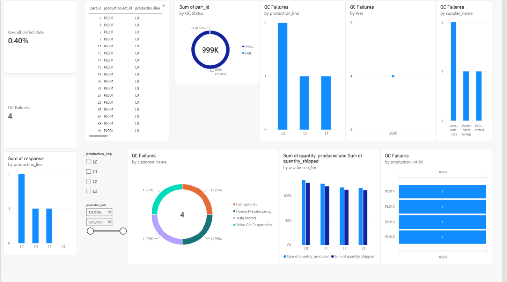
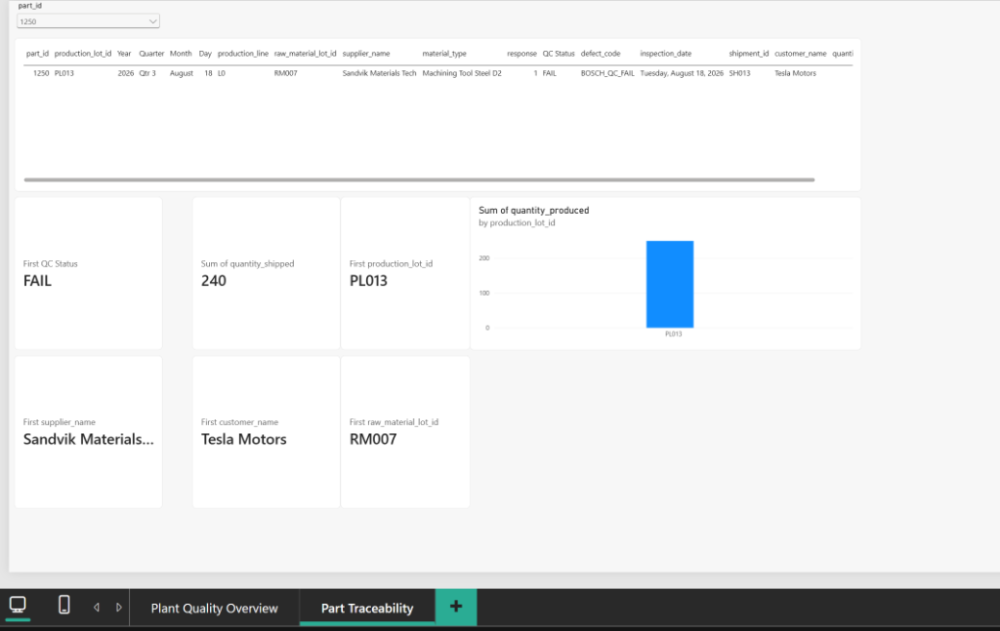

# Manufacturing Parts Traceability Dashboard

> An end-to-end manufacturing traceability portfolio project demonstrating relational database design, SQL analysis, Python data-integrity automation, and Power BI dashboarding.

---

## Overview

Manufacturing organisations need to trace inspected parts through every step of the supply chain — from the raw-material lot and supplier, through the production lot and quality-control inspection, all the way to the outbound shipment and end customer.

This project builds a complete traceability system that answers questions such as:

- Which supplier's material lot is associated with a failed part?
- What is the defect rate per production line?
- Which shipment and customer received a batch that contained a failed part?
- Does the database have integrity problems (orphaned records, quantity violations, duplicate IDs)?

---

## Project Objective

Demonstrate an end-to-end manufacturing traceability workflow using:

| Tool | Purpose |
|---|---|
| **PostgreSQL 18** | Relational database with primary/foreign keys and a denormalised view |
| **SQL** | Schema design, multi-table JOINs, aggregation, CASE expressions, filtering |
| **Python 3 + psycopg** | Automated read-only data-integrity auditing |
| **Power BI Desktop** | Two-page executive and part-level traceability dashboard |
| **Bosch Production Line Performance** | Source QC/part data (part IDs and pass/fail responses only — see Data Provenance) |

---

## Architecture

```
Bosch QC / Part Data (part_id + response)
          │
          ▼
    qc_checks  ◄──────────────────────────────────┐
          │                                        │
          ▼                                        │
  production_lots ──── raw_materials               │
          │                  (supplier, material)   │
          ▼                                        │
      shipments                                    │
     (customer)                                    │
          │                                        │
          ▼                                        │
  traceability_view (flat JOIN of all 4 tables) ───┘
          │
          ├──► Python integrity_check.py
          │         (read-only validation)
          │
          └──► Power BI Dashboard
                 ├── Page 1: Plant Quality Overview
                 └── Page 2: Part Traceability
```

---

## Database Design

The PostgreSQL database `manufacturing_traceability` contains four tables:

### Tables

| Table | Primary Key | Description |
|---|---|---|
| `raw_materials` | `raw_material_lot_id` | Supplier lots (10 rows — 10 suppliers) |
| `production_lots` | `production_lot_id` | Production runs on 4 lines (20 rows) |
| `qc_checks` | `qc_check_id` | One row per inspected part (1,000 rows from Bosch sample) |
| `shipments` | `shipment_id` | Outbound shipments to customers (20 rows) |

### Relationships

```
raw_materials ────< production_lots ────< qc_checks
                         │
                         └────< shipments
```

- `production_lots.raw_material_lot_id` → `raw_materials.raw_material_lot_id`
- `qc_checks.production_lot_id` → `production_lots.production_lot_id`
- `shipments.production_lot_id` → `production_lots.production_lot_id`

### traceability_view

A PostgreSQL view (`traceability_view`) joins all four tables into a single flat dataset of **1,000 rows** (one per QC-inspected part) with 14 columns. This view is the data source for Power BI.

```sql
CREATE OR REPLACE VIEW traceability_view AS
SELECT
    qc.part_id, pl.production_lot_id, pl.production_date, pl.production_line,
    rm.raw_material_lot_id, rm.supplier_name, rm.material_type, pl.quantity_produced,
    qc.response, qc.inspection_date, qc.defect_code,
    s.shipment_id, s.customer_name, s.quantity_shipped
FROM qc_checks qc
JOIN production_lots pl ON qc.production_lot_id = pl.production_lot_id
JOIN raw_materials rm   ON pl.raw_material_lot_id = rm.raw_material_lot_id
JOIN shipments s        ON pl.production_lot_id = s.production_lot_id;
```

See [`sql/schema.sql`](sql/schema.sql) for the full DDL.

---

## Key SQL Capabilities

The SQL files in this project demonstrate:

- **Relational schema design** with primary and foreign keys
- **Data integrity constraints** (`CHECK`, `UNIQUE`, `NOT NULL`, referential integrity)
- **Multi-table JOINs** — tracing a part across four tables in a single query
- **Filtering** — `WHERE qc.response = 1` to isolate failures
- **Aggregation** — `GROUP BY production_line` with `COUNT(*)` and `SUM(...)`
- **CASE expressions** — conditional logic for defect rate calculation
- **Denormalised views** — `traceability_view` for BI tool consumption
- **Subqueries and integrity checks** — orphan detection, quantity violation detection

See [`sql/analysis_queries.sql`](sql/analysis_queries.sql) for worked examples.

---

## Python Integrity Checks

[`python/integrity_check.py`](python/integrity_check.py) performs automated **read-only** validation of the database and exports results to [`python/integrity_report.csv`](python/integrity_report.csv).

### Checks performed

| Check | What it validates |
|---|---|
| `row_count_raw_materials` | Expects 10 rows |
| `row_count_production_lots` | Expects 20 rows |
| `row_count_qc_checks` | Expects 1,000 rows |
| `row_count_shipments` | Expects 20 rows |
| `duplicate_part_ids` | Expects 0 duplicates |
| `invalid_qc_responses` | Expects all values ∈ {0, 1} |
| `broken_production_to_raw_material_links` | Expects 0 orphaned FK references |
| `shipment_quantity_violations` | Expects `quantity_shipped ≤ quantity_produced` for all rows |
| `qc_failure_count` | Count of `response = 1` (informational) |
| `qc_pass_count` | Count of `response = 0` (informational) |

### Current results (all checks PASS)

```
======================================================================
 MANUFACTURING PARTS TRACEABILITY - DATA INTEGRITY AUDIT
======================================================================
Check Name                               | Result     | Status
----------------------------------------------------------------------
row_count_raw_materials                  | 10         | [ PASS ]
row_count_production_lots                | 20         | [ PASS ]
row_count_qc_checks                      | 1000       | [ PASS ]
row_count_shipments                      | 20         | [ PASS ]
duplicate_part_ids                       | 0          | [ PASS ]
invalid_qc_responses                     | 0          | [ PASS ]
broken_production_to_raw_material_links  | 0          | [ PASS ]
shipment_quantity_violations             | 0          | [ PASS ]
qc_failure_count                         | 4          | [ PASS ]
qc_pass_count                            | 996        | [ PASS ]
======================================================================
```

---

## Power BI Dashboard

File: [`powerbi/manufacturing_traceability_dashboard.pbix`](powerbi/manufacturing_traceability_dashboard.pbix)

Data source: PostgreSQL `manufacturing_traceability` → `traceability_view`


## Screenshots

### Page 1 — Plant Quality Overview


### Page 2 — Part Traceability
*Part ID 1250 selected — failed part traced through: PL013 → RM007 → Sandvik Materials Tech → SH013 → Tesla Motors*


### Page 1 — Plant Quality Overview

Executive-level factory-wide dashboard showing:

- **KPI Cards**: Total Parts Inspected · QC Failures · Overall Defect Rate · Production Lines
- **Column charts**: QC Failures by Production Line · Defect Rate % by Production Line
- **Bar charts**: QC Failures by Supplier · QC Failures by Material Type
- **Failed Parts table**: all 4 failed parts with full supplier, production lot, and customer context
- **Slicers**: Production Line · Supplier Name · Material Type · Production Date

### Page 2 — Part Traceability

Individual part genealogy viewer:

- Select any **Part ID** from the dropdown slicer
- Instantly trace: **Part → QC Result → Production Lot → Raw Material Lot → Supplier → Shipment → Customer**
- Shows all 14 fields from `traceability_view` for the selected part

> The Part ID slicer on Page 2 is scoped to Page 2 only and does not filter Page 1 factory-wide visuals.

### DAX Measures

| Measure | Formula |
|---|---|
| `Total Parts Inspected` | `COUNTROWS(traceability_view)` |
| `QC Failures` | `CALCULATE(COUNTROWS(...), response = 1)` |
| `Overall Defect Rate` | `DIVIDE([QC Failures], [Total Parts Inspected], 0)` |
| `Production Lines` | `DISTINCTCOUNT(production_line)` |
| `Shipment Variance` | `SUM(quantity_produced) - SUM(quantity_shipped)` |

---

## Results

Verified outcomes from the 1,000-part Bosch sample:

| Metric | Value |
|---|---|
| Parts inspected | **1,000** |
| QC passes | **996** |
| QC failures | **4** |
| Overall defect rate | **0.40%** |

### Defect rate by production line

| Line | Parts Inspected | Failures | Defect Rate |
|---|---|---|---|
| L0 | 250 | 1 | **0.40%** |
| L1 | 250 | 1 | **0.40%** |
| L2 | 250 | 2 | **0.80%** |
| L3 | 250 | 0 | **0.00%** |

### Failed parts (within simulated genealogy)

| Part ID | Production Lot | Line | Raw Mat Lot | Supplier | Customer |
|---|---|---|---|---|---|
| 1053 | PL011 | L2 | RM006 | POSCO Metals | Volvo Cars |
| 1250 | PL013 | L0 | RM007 | Sandvik Materials Tech | Audi AG |
| 1350 | PL014 | L2 | RM007 | Sandvik Materials Tech | Porsche AG |
| 1793 | PL018 | L1 | RM009 | Nucor Steel Group | Kia Motors |

> **Note:** Parts 1250 and 1350 are both associated with raw material lot RM007 (Sandvik Materials Tech) within the simulated genealogy. This flags RM007 as a candidate for further investigation — but because the supplier relationships are **simulated** (see Data Provenance), this is not evidence of any real supplier quality issue.

---

## Data Provenance & Limitations

> [!IMPORTANT]
> This project uses the [Bosch Production Line Performance dataset](https://www.kaggle.com/c/bosch-production-line-performance) as the source for QC part IDs and pass/fail responses (`response` column) only.

**What is authentic Bosch data:**
- `part_id` values (the Bosch competition `Id` field)
- `response` values (0 = pass, 1 = fail)

**What is simulated for this portfolio project:**
- Production lot assignment (`production_lot_id`)
- Raw material lot assignment (`raw_material_lot_id`)
- Supplier names and material types
- Production lines, dates, and quantities
- Shipments and customer names

The Bosch Production Line Performance dataset does **not** contain supplier genealogy, production lot structure, or customer shipment data. Those relationships were designed and simulated to create a realistic traceability demonstration.

**This project is a portfolio demonstration of traceability architecture, relational database design, and analytics. It is not a reconstruction of Bosch's actual manufacturing processes or supply chain.**

---

## How to Run

### Prerequisites

- PostgreSQL 18+ installed and running on port 5432
- Python 3.10+ with `psycopg[binary]` installed:
  ```bash
  pip install "psycopg[binary]"
  ```
- Power BI Desktop (Windows, free from Microsoft)

### Step 1 — Create the database and schema

```bash
# Set your PostgreSQL password for this session (never hardcode it)
$env:PGPASSWORD = "your_password_here"

# Create the database
psql -U postgres -h localhost -p 5432 -c "CREATE DATABASE manufacturing_traceability;"

# Create all tables and the view
psql -U postgres -h localhost -p 5432 -d manufacturing_traceability -f sql/schema.sql
```

### Step 2 — Load reference data

```bash
psql -U postgres -h localhost -p 5432 -d manufacturing_traceability -f sql/data_load.sql
```

### Step 3 — Load QC check data from the Bosch sample

The 1,000-row Bosch sample is included at `data/bosch_sample.csv`.

To load it into `qc_checks`, you can use the provided sample data or write a small Python loader. The original Bosch dataset can be downloaded from:

[https://www.kaggle.com/c/bosch-production-line-performance](https://www.kaggle.com/c/bosch-production-line-performance)

> The full Bosch dataset (~14.6 GB uncompressed) is **not** included in this repository.

### Step 4 — Set the PGPASSWORD environment variable

**Windows PowerShell:**
```powershell
$env:PGPASSWORD = "your_password_here"
```

**Linux / macOS:**
```bash
export PGPASSWORD="your_password_here"
```

> Never store your password in a script, `.env` file committed to git, or any plain-text file.

### Step 5 — Run the integrity checker

```bash
cd python
py integrity_check.py
```

Expected output: all 10 checks return `[ PASS ]`. A `integrity_report.csv` file is written in the same directory.

### Step 6 — Open the Power BI report

1. Open Power BI Desktop.
2. Open `powerbi/manufacturing_traceability_dashboard.pbix`.
3. When prompted for the PostgreSQL connection, enter:
   - **Server**: `localhost`
   - **Database**: `manufacturing_traceability`
   - **Username**: `postgres`
   - **Password**: *(enter your local PostgreSQL password)*
4. Click **Load** / **Refresh**.

---

## Project Structure

```
manufacturing-parts-traceability/
├── README.md                          # This file
├── .gitignore                         # Excludes secrets, caches, large files
│
├── sql/
│   ├── schema.sql                     # CREATE TABLE + CREATE VIEW DDL
│   ├── data_load.sql                  # Reference data for raw_materials, production_lots, shipments
│   └── analysis_queries.sql           # Worked SQL examples (traceability + defect analysis)
│
├── python/
│   ├── integrity_check.py             # Read-only automated data integrity audit
│   └── integrity_report.csv           # Sample output (all checks PASS)
│
├── data/
│   └── bosch_sample.csv               # 1,000-row Bosch QC sample (part_id + response + features)
│
├── powerbi/
│   └── manufacturing_traceability_dashboard.pbix   # Two-page Power BI dashboard
│
└── screenshots/                       # Dashboard screenshots (add manually)
```

---

## Technologies Used

- **PostgreSQL 18.6** — relational database
- **psql** — command-line PostgreSQL client
- **Python 3.13** — scripting and automation
- **psycopg 3** — PostgreSQL driver for Python
- **Power BI Desktop** — business intelligence dashboard
- **Git + GitHub** — version control

---

## Licence

This project is released for portfolio and educational purposes.

The Bosch Production Line Performance dataset is subject to its own Kaggle competition licence. This project uses only a 1,000-row sample of the training data (part IDs and pass/fail labels) for demonstration purposes.

